# C-vault: Screenshots 

---

<a href="C-vault-2.png">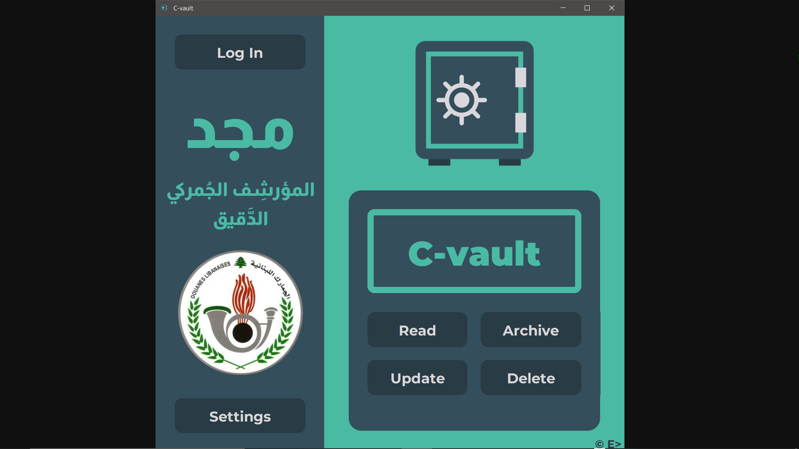</a>
<a href="C-vault-3.png">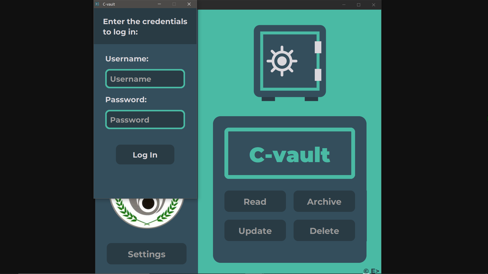</a>
<a href="C-vault-4.png">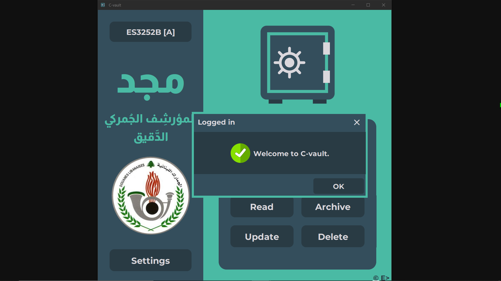</a>
<a href="C-vault-5.png">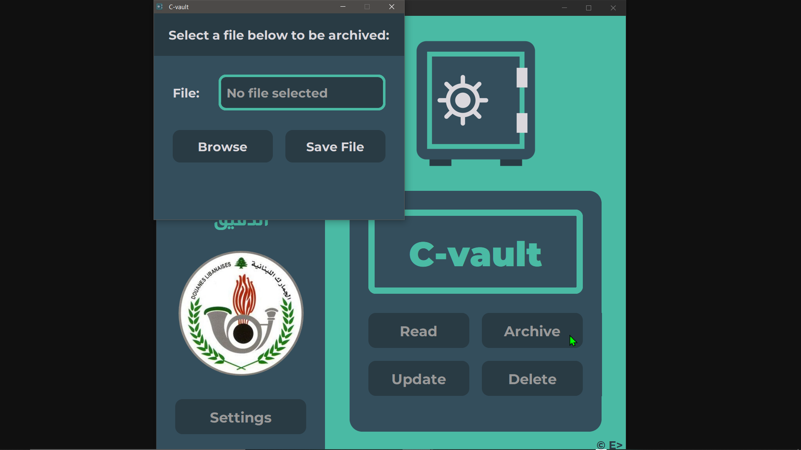</a>
<a href="C-vault-6.png">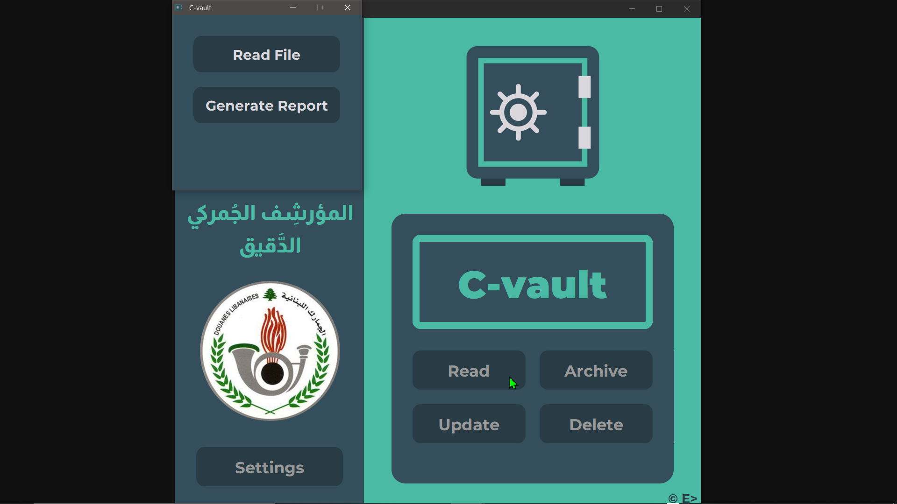</a>
<a href="C-vault-7.png">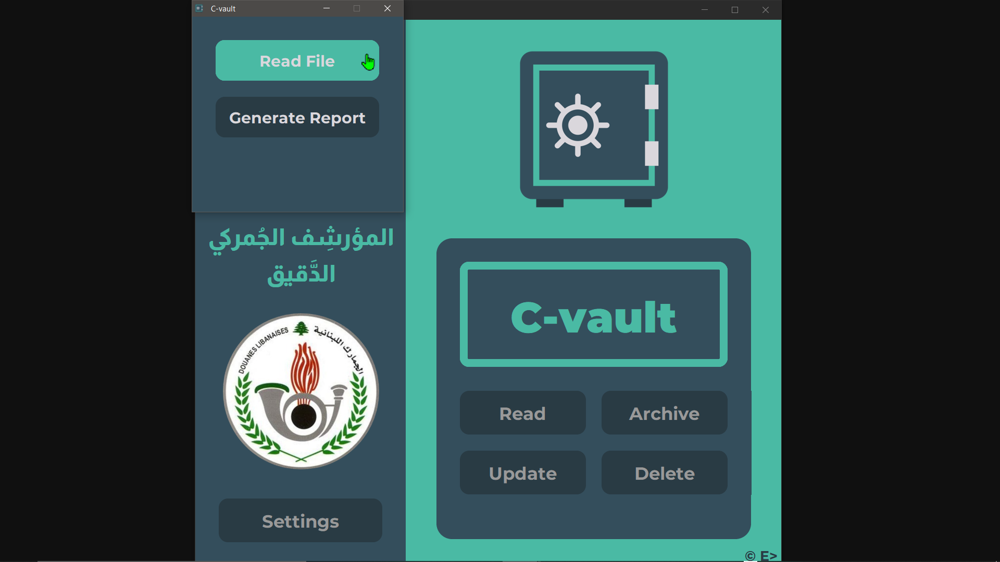</a>

<a href="C-vault-9.png">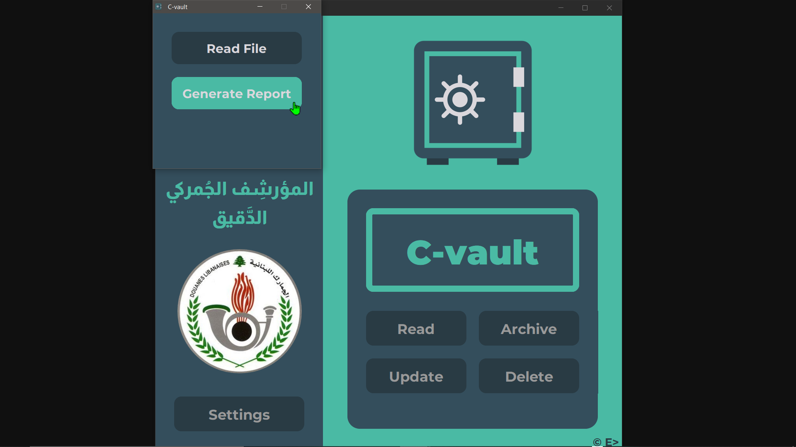</a>
<a href="C-vault-10.png">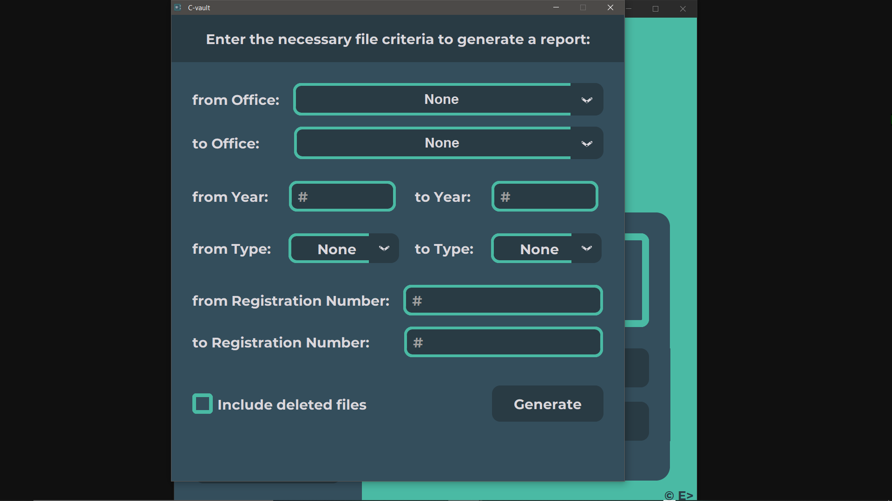</a>

<a href="C-vault-12.png">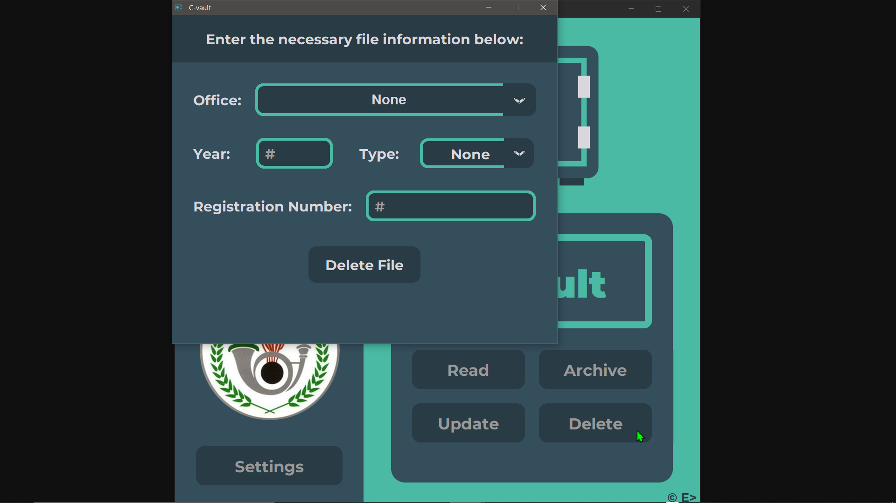</a>
<a href="C-vault-13.png">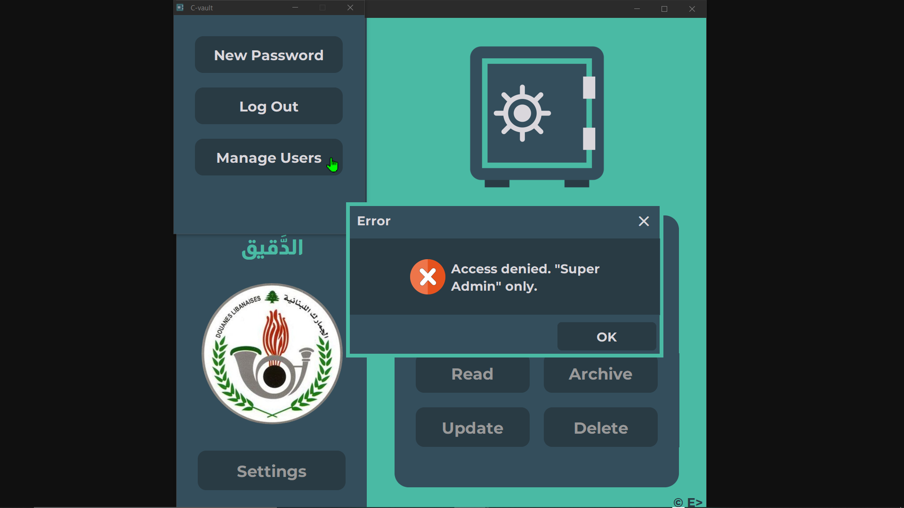</a>
<a href="C-vault-14.png">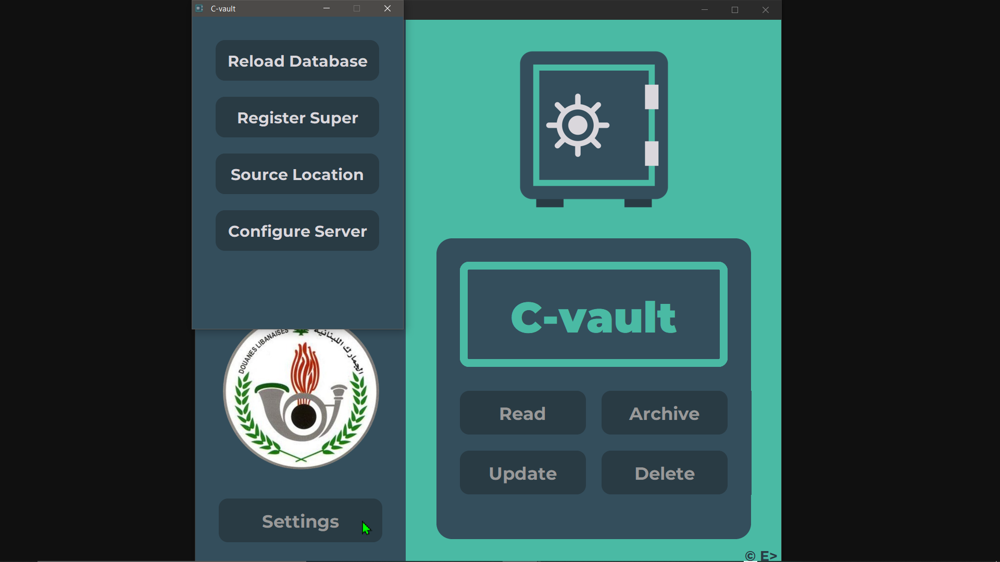</a>
<a href="C-vault-15.png">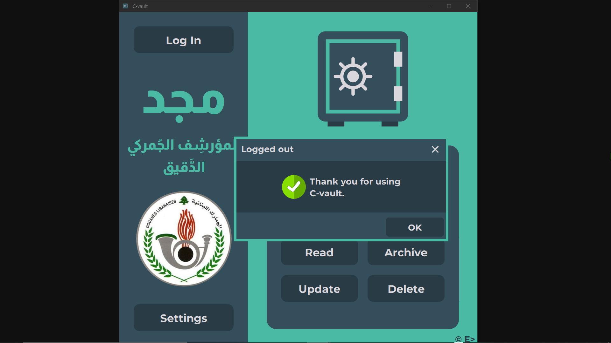</a>

---

### ⬅ [🔗 Back to Premium Projects](../../../README.md#-application-development)

