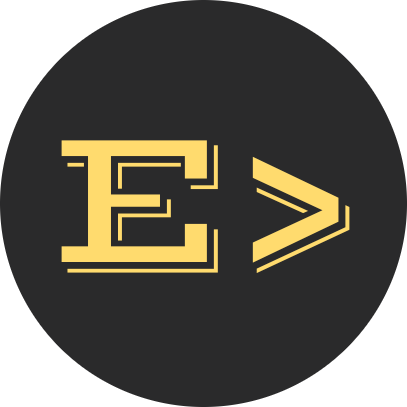
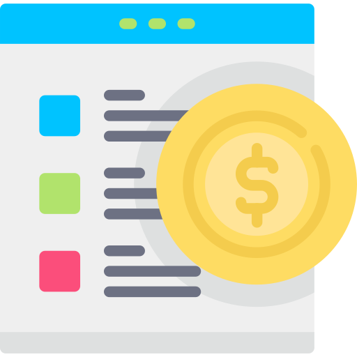
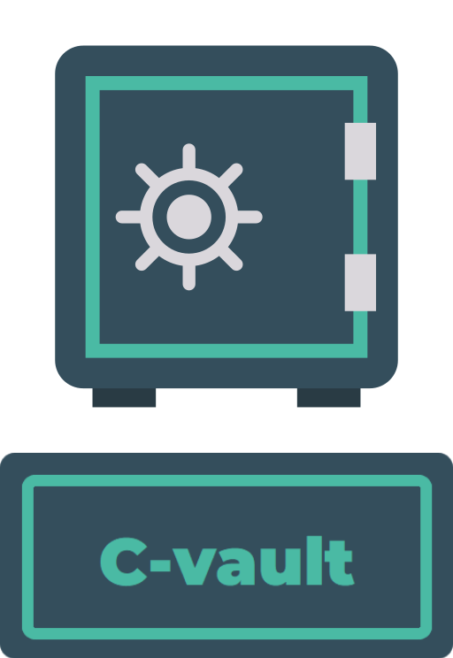
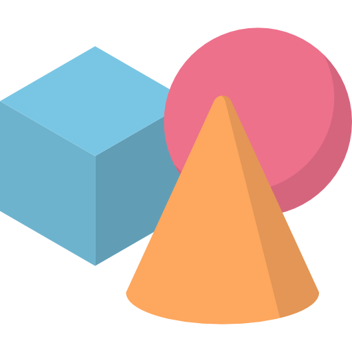

# Premium AI & Software Solutions

## 📝 **Overview** 
In today’s competitive landscape, businesses need **intelligent, scalable, and high-performance solutions** to stay ahead. This collection of **premium projects** offers **cutting-edge software and AI-powered innovations**, providing **ready-to-use, enterprise-grade applications** that can be **customized, expanded, and integrated** to meet your specific business needs.  

Whether you’re looking to **automate processes, optimize decision-making, enhance user experiences, or leverage AI**, these solutions are built with **efficiency, scalability, and flexibility** at their core. While many projects leverage **AI and LLMs**, others offer **powerful non-AI solutions** designed to streamline operations and improve productivity.  

💡 **Every project is designed for real-world impact; whether in finance, e-commerce, automation, or enterprise solutions.** If you’re looking for a **customized version** or want to **integrate AI and software solutions into your business**, let’s discuss how we can make it happen.  

---

## 🚀 **Premium Projects**   
These **high-quality solutions** are built for **real-world impact** and can be **tailored to fit your business needs**.

### **Why Choose These Projects?**  
✔ **Scalability** - Built to handle growth and high demand.  
✔ **Efficiency** - Optimized for performance and reliability.  
✔ **Customization** - Fully adaptable to your unique needs.  
✔ **Modularity** - Can be used as a **base for other projects**, making development faster and more cost-effective.  

💡 **Interested?** I offer flexible access levels, from limited previews to full customization and deployment. Contact me to discuss how I can tailor a solution for you.  

---

## 🧠 AI and LLM Solutions
### [🔒 **CalisMind** 🔗](projects/CalisMind/README.md)  
*AI-powered calisthenics assistant that transforms calisthenics knowledge into an interactive learning experience. Get real-time insights, detailed exercise breakdowns, and expert guidance tailored to your fitness journey.*

### [🔒 **DataSynth** 🔗](projects/DataSynth/README.md)  
*AI-driven synthetic dataset generator for researchers, data scientists, and developers. Supports multiple LLMs, allowing seamless dataset creation through an intuitive Gradio-based web UI.*

### [🔒 **MeetingRecap** 🔗](projects/MeetingRecap/README.md)  
*AI-powered meeting summarization tool that transcribes and extracts key insights from audio recordings. Uses OpenAI's Whisper for speech-to-text conversion and Meta's LLaMA for structured meeting minutes.*

### [🔒 **PriceWise** 🔗](projects/PriceWise/README.md)  
*AI-driven price tracking and deal discovery platform that monitors e-commerce pricing trends in real time. Predicts fair prices using machine learning and sends automated alerts for the best deals.*

---

## 💻 **Application Development**  
### [🔒 **C-Vault** 🔗](projects/C-Vault/README.md)  
*Secure, efficient customs declaration management system developed for the Lebanese Customs Authority. Designed in response to the 2020 Port Beirut blast, it leverages advanced security measures and streamlined archiving to prevent data loss and enhance operational efficiency.*

### [🔒 **CensorFace** 🔗](projects/CensorFace/README.md)  
*A Python tool for enhancing privacy in videos by censoring faces using blurring, boxing, or cat face overlays. Ideal for anonymizing individuals in public footage or sensitive content.*  

  

### [🔒 **MarketMapper** 🔗](projects/MarketMapper/README.md)  
*A Python-based tool for downloading historical stock data from Yahoo Finance and scraping real-time currency conversion rates. Designed for traders, analysts, and finance professionals looking to streamline market data retrieval.*  

  

### [🔒 **NoteStruct** 🔗](projects/NoteStruct/README.md)  
*A Python tool for generating structured, printable PDF notebooks with customizable topics and layouts. Designed to mimic real notebooks with lined pages and a yellow background, it's perfect for education, study, and professional note-taking.*  

  

### [🔒 **ShapeArt** 🔗](projects/ShapeArt/README.md)  
*A Python CLI tool for drawing and saving shape-based artwork. Create circles, rectangles, and squares with customizable sizes and colors on a digital canvas.*  

  

---

## 💼 **How to Get Access?**  
I offer **flexible access options** based on your needs. Whether you need **full repository access, specific files, or a customized version**, I’ve got you covered.  

### **1️⃣ Get in Touch**  
💡 **Let’s find the best solution for your business.**  

📩 **Email:** [emadsaab222@gmail.com](mailto:emadsaab222@gmail.com)  
💬 **LinkedIn:** [in/emadsaab](https://www.linkedin.com/in/emadsaab/)   

### **2️⃣ Define Your Requirements**  
- Do you need **full access** to a project? 🚀  
- Are you looking for **a customized version** tailored to your business? 🛠️  
- Need **only specific files** or a **lightweight version**? 🎯  
- Want to **build an entirely new Python or LLM-powered project from scratch**? 🔥  

### **3️⃣ Secure Payment**  
💰 **Payments are processed through PayPal, Stripe, or Wise**, with industry-standard encryption ensuring security and reliability. Pricing varies based on access level and customization.  

### **4️⃣ Receive Access**  
🔹 **GitHub Access** - You’ll be added as a collaborator for full repo access within **24 hours**.  
🔹 **ZIP File** - A downloadable package with selected files or the entire codebase within **1-2 business days**.  
🔹 **Custom Work** - Delivery timeline depends on project scope (discussed individually).  

---

## 📌 **Why Choose My Solutions?**  
✅ **Professionally Built** - Clean, efficient, and scalable code.  
✅ **Customizable** - Tailored solutions for your business needs.  
✅ **Direct Support** - Personalized assistance and improvements.  
✅ **Exclusive Access** - Premium projects available only to selected clients.  

---

## 🤝 **Let's Build Something Amazing**  
**Let’s turn your vision into reality.** Whether you need a custom AI solution or access to one of these premium projects, let’s make it happen. **[Reach out today!](#1️⃣-get-in-touch)**

---  

🚀 *Innovation starts with the right tools. Let’s create something powerful together!*  

---