# DataSynth: Screenshots 

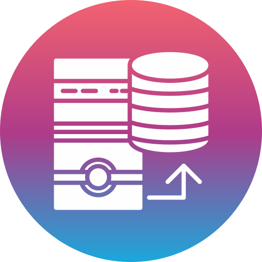

---

<a href="DataSynth-2.png">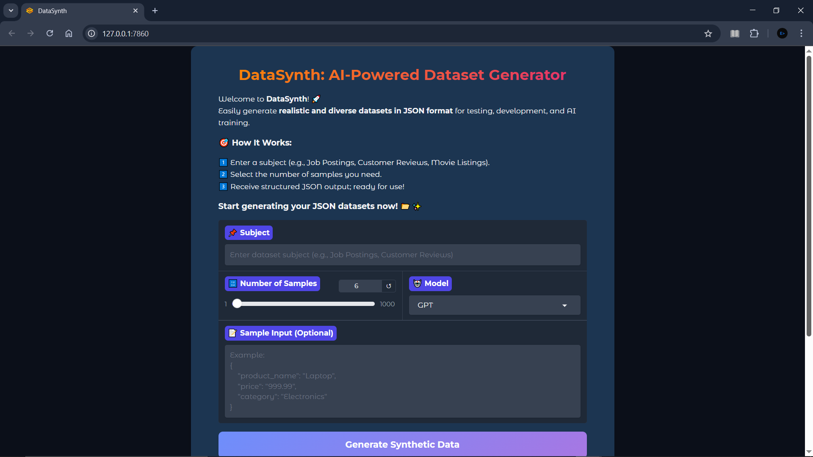</a>
<a href="DataSynth-3.png">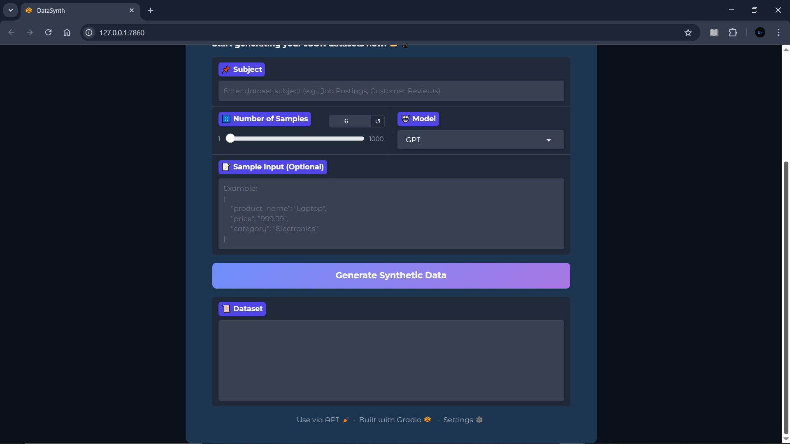</a>
<a href="DataSynth-4.png">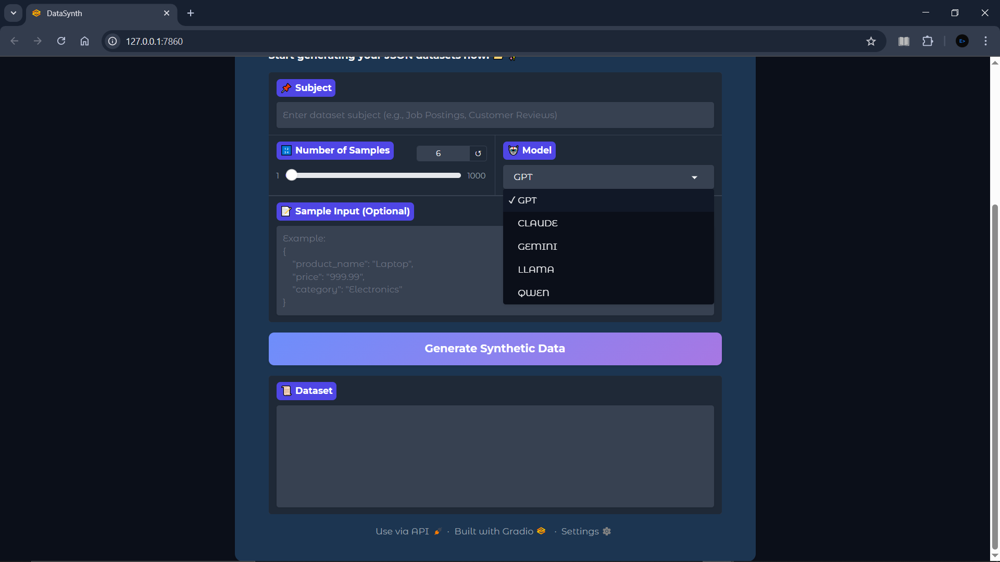</a>
<a href="DataSynth-5.png">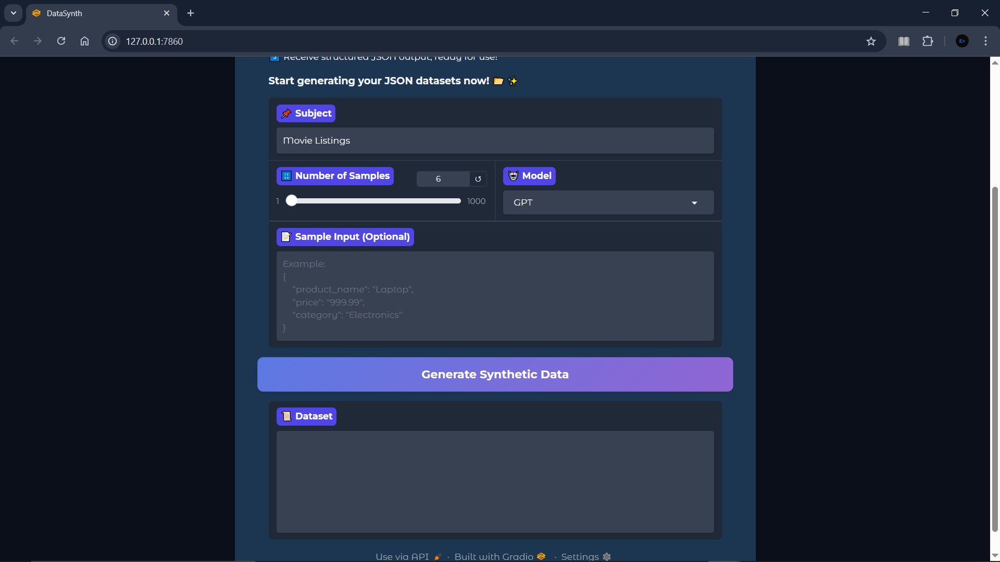</a>
<a href="DataSynth-6.png">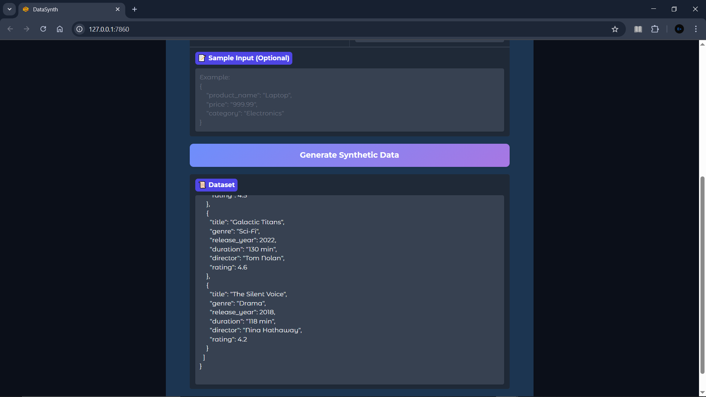</a>
<a href="DataSynth-7.png">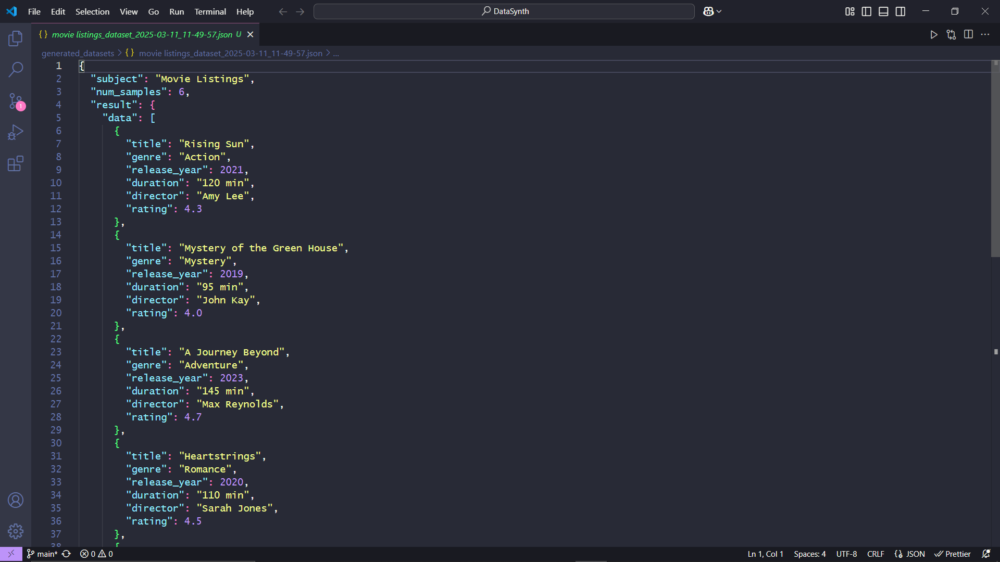</a>
<a href="DataSynth-8.png">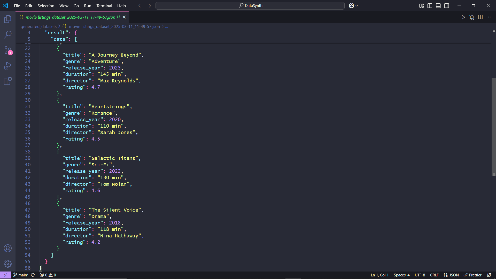</a>
<a href="DataSynth-9.png">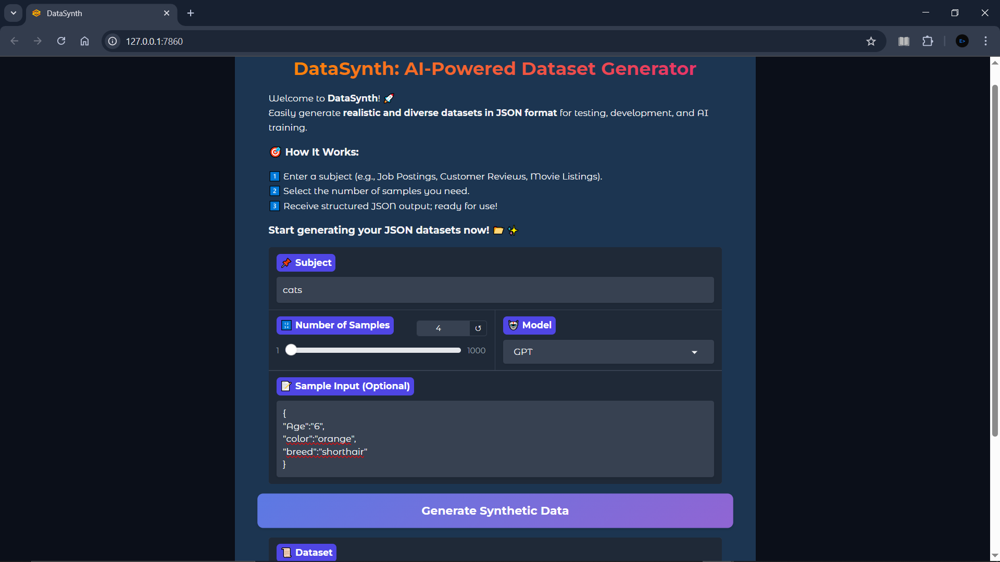</a>
<a href="DataSynth-10.png">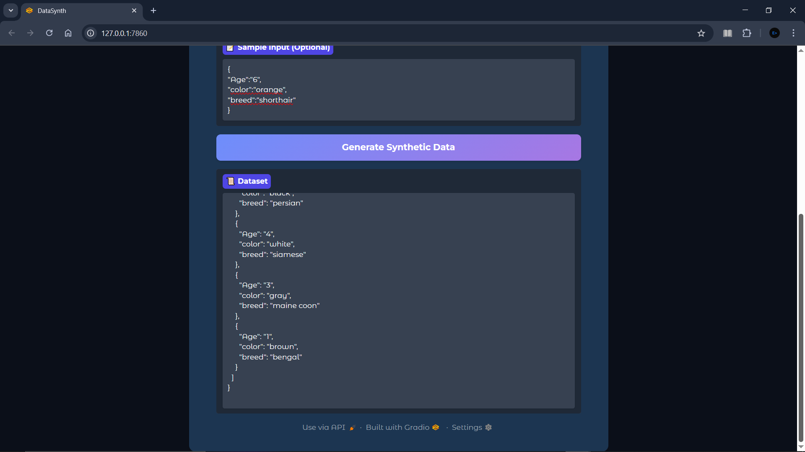</a>
<a href="DataSynth-11.png">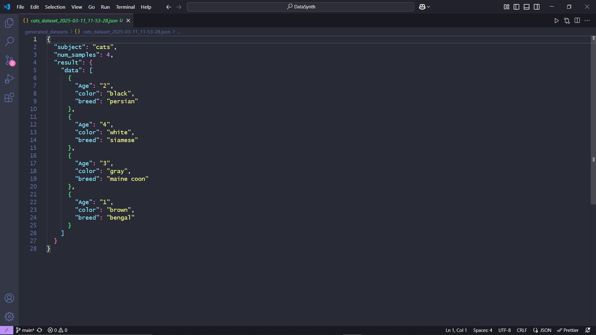</a>

---

### ⬅ [🔗 Back to Premium Projects](../../../README.md#-ai-and-llm-solutions)

